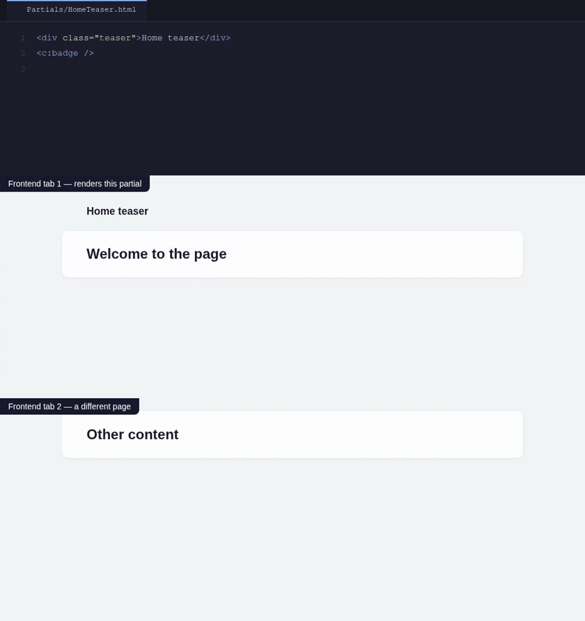

<p align="center">
  
</p>
<h1 align="center">Live Reload</h1>
<p align="center"><em>Save a record in the backend — or a Fluid partial in your editor. The right browser tabs reload. Nothing else moves.</em></p>
<br>

[](https://github.com/wazum/typo3-live-reload/actions)
[](https://www.php.net/)
[](https://typo3.org/)
[](https://packagist.org/packages/wazum/typo3-live-reload)
[](LICENSE)

Two kinds of changes reach your open browser tabs, both precisely targeted: **[content edits](#content-reloads)** in the TYPO3 backend and **[source-file edits](#file-reloads)** in your code editor. Both work through the same mechanism — a changed *thing* becomes a tag, each page carries the tags it rendered, and a tab only reloads when the two intersect. Tabs that are not affected keep their scroll position, form state, and open dialogs.

How a change reaches the browser is decided by the environment, not by you: when a Vite dev server is running it is pushed over the WebSocket Vite already holds open; when none runs — a plain local install, or a shared Staging environment — each open tab polls a small endpoint instead (content changes only; file reloads need the dev server's file watcher).

## Installation

```bash
composer require --dev wazum/typo3-live-reload
```

That is the whole install for content reloads. In the Development context it is active at once: open some frontend pages, edit content in the backend, and the right tabs reload. Without a Vite dev server the tabs poll a small endpoint on their own.

If you run a Vite dev server, add the bundled plugin to `vite.config.ts` — reloads are then pushed instead of polled, and the `watch` option enables the targeted **file reloads** (no npm package needed — the compiled plugin is part of the Composer package):

```ts
import { defineConfig } from 'vite'
import { liveReload } from './vendor/wazum/typo3-live-reload/Resources/Private/Vite/dist/index.js'

export default defineConfig({
    plugins: [
        // ...your other plugins
        liveReload({
            watch: { paths: ['packages'] }, // your extension/template directories
        }),
    ],
})
```

The import path is relative to `vite.config.ts` — adjust it if your config file is not next to `vendor/`. Omit the `watch` option if you only want content reloads.

## Content Reloads

When an editor saves a content element, a page, or a news record, every open frontend tab that shows this record reloads by itself. TYPO3's own cache tags decide which tabs are affected: each page knows the tags it rendered, each save knows the tags it flushed, and each tab compares the two.


Saving in the backend is never slowed down: the change is broadcast after the editor's response is already sent, and a failed broadcast is silent — a save never breaks. A page without tag data reloads on every change instead of missing one.

> [!IMPORTANT]
> Enable the **`frontend.cache.autoTagging`** feature toggle. It is on by default only for **new** TYPO3 installations — upgraded sites must set it themselves:
>
> ```php
> $GLOBALS['TYPO3_CONF_VARS']['SYS']['features']['frontend.cache.autoTagging'] = true;
> ```
>
> Without it, TYPO3 does not tag rendered content with `<table>_<uid>` tags, and content reloads only happen for edits on the exact page you are looking at. File reloads are unaffected.

### Reload for Editors (Without a Dev Server)

The content reload also works where no Vite dev server runs — typically a Staging environment. An editor saves a record in the backend, and every preview tab of a logged-in backend user that shows this record reloads. Only the transport changes: instead of the dev server's WebSocket, each tab asks a small endpoint every few seconds whether something changed. Tag matching, reload modes, the `typo3:live-reload` events, and the Admin Panel module all work exactly as described — the Status tab shows which transport is active.

For this, install the package as a regular dependency instead of `--dev`, so it ships with your release:

```bash
composer require wazum/typo3-live-reload
```

Then name the **exact** application context of the environment in `activeContexts`:

```
activeContexts = Development,Production/Staging
```

An entry matches itself and its subcontexts, and a bare `Production` entry is silently ignored — so a staging configuration that ends up on a real production system (context `Production`) activates nothing. The Development context keeps its Vite transport; every other allowed context polls automatically. There is no transport setting.

Outside the Development context, a valid backend user session is required — this is not configurable:

- Without a backend session, nothing is injected: no configuration, no tag data, no script. Anonymous visitors get the exact page they would get without the extension.
- The poll endpoint (`/__live-reload/poll`) answers a bare 404 without a backend session, and in contexts that are not allowed at all it is not even claimed — the path behaves like any other unknown URL on your site.

`pollInterval` controls how often each tab asks for changes (so a reload arrives within that many milliseconds after a save), and `retention` controls how long a broadcast stays answerable — a tab that was hidden longer than that simply reloads once to catch up. The defaults are fine for editing workflows.

### Broadcasting Tags from Other Extensions

Some extensions flush extra cache tags directly through the `CacheManager`. Those tags are invisible to the DataHandler's tag list. Add them back with a `ModifyBroadcastTagsEvent` listener — for example for [georgringer/news](https://extensions.typo3.org/extension/news):

```php
use TYPO3\CMS\Core\Attribute\AsEventListener;
use Wazum\LiveReload\Event\ModifyBroadcastTagsEvent;

#[AsEventListener(identifier: 'news/broadcast-tags')]
final class NewsBroadcastTagsListener
{
    public function __invoke(ModifyBroadcastTagsEvent $event): void
    {
        if ($event->getTable() !== 'tx_news_domain_model_news') {
            return;
        }

        $event->addTags('tx_news_uid_' . $event->getUid(), 'tx_news_pid_' . $event->getUidPage());
    }
}
```

The event has `getTable()`, `getUid()`, `getUidPage()`, `getTags()`, and `addTags(string ...$tags)`.

Matching works as an intersection: a broadcast tag only reloads tabs whose **rendered page** also carries that tag. Tags like `tx_news_uid_*` exist on pages that display the record (the news extension adds them while rendering) — a tag that only exists on the broadcast side will never match anything.

## File Reloads

When you save a Fluid template, partial, layout, component — or a ViewHelper class — every open tab whose page actually **rendered that file** reloads. Not every tab: each page carries a fingerprint of the files its render used, recorded live during rendering. Vite's own hot reload cannot do this, because server-rendered Fluid never enters its module graph; this extension closes exactly that gap.



The usual workaround — watch the template folder and full-reload *every* tab — throws away state in tabs that never rendered the file. This extension reloads only the right ones:

| You change | What happens | Handled by |
|---|---|---|
| A record in the backend | Affected tabs reload | [content reloads](#content-reloads) |
| A Fluid template, partial, or layout | **Tabs that rendered it** reload | this section |
| A Fluid component (`<my:atom.button>`) | **Tabs that rendered it** reload | this section |
| A ViewHelper class | **Tabs whose templates use it** reload | this section |
| CSS / TypeScript | Hot update, often without reload | Vite HMR (via vite-asset-collector) |

### How capture works

In the Development context the extension decorates TYPO3's view factory. Every Fluid view records the template, partial, and layout files it resolves, every ViewHelper class it instantiates (reflection gives the class file), and — through a wrapped resolver delegate — the template files of Fluid v4 **component collections**. The recorded absolute paths are normalized to **project-relative** paths (symlinks resolved first, so a Composer path-repository extension under `vendor/` maps back to its real `packages/…` source; files inside the actual vendor directory are dropped). The result is injected as `file:` tags alongside the cache tags.

On the Vite side, `watch.paths` are handed to the dev server's existing watcher. A changed `.html` or `.php` file becomes the same project-relative `file:` tag — both sides read the same repository layout, so the strings match even when PHP runs in a container and Vite on the host. Vite's default full-reload for those files is suppressed; the targeted broadcast replaces it.

### The `watch` option

```ts
liveReload({
    watch: {
        paths: ['packages'],          // directories to watch, relative to projectRoot (or absolute)
        extensions: ['.html', '.php'], // default
        projectRoot: process.cwd(),    // default; the path project-relative tags are computed against
    },
})
```

`paths` reuses Vite's own watcher, so your `server.watch` options apply — for example `usePolling: true` in Docker setups where file events do not cross the mount.

### The page-cache trade-off

A page served from TYPO3's page cache skips rendering — and a tab served from cache would carry no file fingerprint and stop reacting to template edits. While file reload is enabled, the extension therefore disables the frontend **page cache in the Development context**, so every render reflects the current files. If you would rather keep the page cache (and only need content reloads), switch it off:

```
fileReload = 0
```

This removes the render instrumentation and leaves the page cache alone — content reloads keep working on cached pages, because TYPO3 restores cache tags from the cache entry.

### Sharp fingerprints

Fluid parses whole template files: a ViewHelper referenced anywhere in a parsed file counts as *used* by every page rendering that file — even inside a condition branch that did not execute. Partials, however, are parsed lazily, only when actually rendered. If you want page-type-specific ViewHelpers to reload only *their* pages, keep their usage inside the partial that only those pages render. (Erring happens in the safe direction either way: at worst a tab reloads that did not strictly need to.)

### File-reload limitations

- File reloads need the Vite dev server transport — the poll transport has no file watcher.
- A **newly created** partial is not in any open tab's fingerprint yet; the first change after creating a file may need one manual reload.
- Only Fluid views created through TYPO3's view factory are captured — that covers `PAGEVIEW`, `FLUIDTEMPLATE`, Extbase, and fluid-styled-content; hand-instantiated `TemplateView`s are not seen.
- Editing a PHP file triggers the reload; whether the change is *visible* also depends on your opcache settings (`opcache.revalidate_freq=0` in development, which DDEV sets by default).

## What Both Share

**Nothing for visitors** – The extension is only active in the configured application contexts (default: `Development`), and a bare `Production` context can never activate. Outside Development a valid backend session is required, so anonymous visitors get nothing and never see the endpoint. Nothing of this reaches production.

**Safe by design** – A failed broadcast is silent, an uninstrumentable view renders exactly as without the extension, and a page without tag data reloads on every change instead of missing one.

**Scroll position stays** – Browsers restore it on reload by default; when a framework (for example Turbo) sets `history.scrollRestoration = 'manual'`, the client restores it itself.

**You can take over the reload** – A cancelable `typo3:live-reload` DOM event fires before each reload. Cancel it and [morph the page in place](#morph-instead-of-reload) instead.

**Works with CSP** – Injected scripts get TYPO3's CSP nonce automatically, including the `csp-nonce` meta element that Vite's own client expects. See [Content Security Policy](#content-security-policy).

**Admin Panel module** – Status, the page's cache tags, a live broadcast feed, and a pause switch for your session. See [Admin Panel](#admin-panel).

## How It Works

```
┌─────────────────────────────┐            ┌─────────────────────────────┐
│         TYPO3 (PHP)         │            │       Vite dev server       │
│                             │            │                             │
│ DataHandler save/delete     │            │ liveReload() plugin         │
│  └─ flushed cache tags      │───POST────▶│  debounce → broadcast       │
│                             │            │  over the HMR websocket     │
│ Fluid render                │            │          ▲                  │
│  └─ used files recorded     │            │ watcher: changed template   │
│                             │            │ or PHP file → file: tag     │
│ middleware injects the      │            │          │                  │
│ page's cache tags and       │            │          ▼                  │
│ file: tags + the client     │◀──HMR ws───│ virtual:live-reload module  │
└─────────────────────────────┘            └─────────────────────────────┘
                                                       │
                                                       ▼
                                     each tab: broadcast ∩ own tags ≠ ∅ ?
                                     → cancelable event → reload
```

1. **In:** a middleware reads the cache tags of the current page (from TYPO3's frontend cache data collector, plus a `pageId_<uid>` fallback) **and the files the render used** and writes them into the page as `window.__liveReload`, together with a `<script type="module">` that the Vite dev server serves.
2. **Out, content:** a `clearCachePostProc` hook collects the tags TYPO3 flushes for a saved record and posts them to the dev server — after the editor's response is already sent.
3. **Out, files:** the Vite plugin's watcher turns a changed file into a `file:<project-relative-path>` tag — no PHP round trip; the watcher is the change signal.
4. The dev server broadcasts once per batch; every tab compares the tags and reloads only when they overlap.

## Morph Instead of Reload

The injected client fires a **cancelable** `CustomEvent` on `document` before each reload. Cancel it and update the page yourself — with Turbo:

```js
document.addEventListener('typo3:live-reload', (event) => {
    event.preventDefault()
    Turbo.visit(window.location.href, { action: 'replace' })
})
```

`event.detail.tags` contains the broadcast tags (`file:` tags included, so you can react differently to template edits). Without a listener (or without `preventDefault()`), the tab does a full reload.

Without Turbo, [idiomorph](https://github.com/bigskysoftware/idiomorph) (the morph engine behind Turbo 8 page refreshes) gives you in-place updates in a few lines — only the changed DOM nodes are swapped, so scroll position, focus, open dialogs, and JS state survive an edit:

```js
document.addEventListener('typo3:live-reload', (event) => {
    event.preventDefault()
    void (async () => {
        try {
            const { Idiomorph } = await import('idiomorph')
            const response = await fetch(window.location.href, { cache: 'no-store' })
            if (!response.ok) throw new Error(`Unexpected response status ${response.status}`)
            const next = new DOMParser().parseFromString(await response.text(), 'text/html')
            Idiomorph.morph(document.body, next.body, {
                callbacks: {
                    // keep the live Admin Panel (connection status, broadcast feed):
                    // the fetched page only contains its server-rendered placeholder
                    beforeNodeMorphed: (oldNode) => oldNode.id !== 'TSFE_ADMIN_PANEL_FORM',
                },
            })
        } catch (error) {
            console.warn('[live-reload] morph failed, falling back to reload:', error)
            window.location.reload()
        }
    })()
})
```

Three practical notes from real-project use: register the listener only when `window.__liveReload` exists (so production never runs it); add `optimizeDeps: { include: ['idiomorph'] }` to your vite config — otherwise vite discovers the dependency on first use and answers with its own forced full reload; and exclude client-stateful widgets like the Admin Panel from the morph (the callback above), because the fetched HTML only carries their initial server-rendered state.

## Requirements

- TYPO3 `^13.4 || ^14.3`, PHP `^8.2`, Vite `>=5.1` (only for the dev-server transport)

## Configuration

Extension Configuration (`live_reload`) or `$GLOBALS['TYPO3_CONF_VARS']['EXTENSIONS']['live_reload']`:

| Setting | Default | Purpose |
|---|---|---|
| `activeContexts` | `Development` | Application contexts (comma list) where the extension is active; an entry matches itself and its subcontexts (`Development` also covers `Development/Docker`); a bare `Production` entry is ignored — name the exact subcontext instead |
| `reloadMode` | `tagged` | `tagged` = only affected tabs reload; `always` = every connected tab |
| `fileReload` | `1` | Record rendered files and reload on template/ViewHelper changes; disables the frontend page cache in the Development context (see [the trade-off](#the-page-cache-trade-off)) |
| `viteServerInternalUrl` | `http://localhost:5173` | Dev server URL reachable from PHP (broadcast target) |
| `viteServerPublicUrl` | *(empty)* | Dev server URL reachable from the browser; empty = resolve automatically |
| `pollInterval` | `3000` | Milliseconds between polls when the [editor reload](#reload-for-editors-without-a-dev-server) transport is active; minimum `1000` |
| `retention` | `300` | Seconds a broadcast stays answerable for polling tabs; minimum `60` |

The browser-facing URL is resolved in this order: the explicit setting → vite-asset-collector's `auto` chain (which understands, for example, `ddev-vite-sidecar`'s `VITE_SERVER_URI`) → none. With none, the extension stays inactive for that request.

`viteServerInternalUrl` is where **PHP** posts the flushed tags. In Docker/DDEV setups `http://localhost:5173` is only correct when Vite runs in the same container as PHP-FPM. Broadcast failures are silent on purpose (a save must never break), so when reloads do not happen, first check the URL from the PHP side:

```bash
ddev exec 'curl -s -o /dev/null -w "%{http_code}" -X POST http://localhost:5173/__typo3-live-reload -H "Content-Type: application/json" -d "{\"tags\":[]}"'
```

`204` means PHP can reach the dev server. The Admin Panel's Status tab (see below) shows both URLs at one glance.

The Vite plugin accepts a `debounceMs` option (default `200`) — how long broadcasts are collected before they go to the browser; watcher events and posted tags share the same batch. An `endpoint` option also exists, but the PHP side always posts to `/__typo3-live-reload`; changing the endpoint only makes sense when a proxy rewrites that path. The `watch` option is described [above](#the-watch-option).

## Admin Panel

With [EXT:adminpanel](https://packagist.org/packages/typo3/cms-adminpanel) installed, a **Live Reload** module appears in the frontend Admin Panel.

The panel bar itself shows the essentials at one glance, without opening the module: a connection dot (green and gently pulsing while the dev server is connected, a red ring when the connection was lost, with a short flash for every received broadcast), the reload mode — but only when it differs from the normal `tagged` — and the time of this tab's last update. The everyday healthy state is just the green dot and a time like `21:58`; anything unusual (`paused`, `always`, a lost connection) announces itself by appearing. Animations respect `prefers-reduced-motion`.

A **gray ring** means the page never connected. This happens when the page was loaded while the dev server was down: without a dev server there is nothing to inject, so such a tab cannot hear any broadcast — including the one that would reload it. Reload the tab once after the dev server is back; from then on it heals itself.

The module itself has three tabs:

**Status** – Is the extension active in this context? Which reload mode is in effect? Which dev-server URL was resolved, and by which step? Is `frontend.cache.autoTagging` on? Everything you would otherwise check with curl.

**Cache tags** – The full tag list collected for the current page. Useful for cache debugging in general, not only for live reload.

**Broadcasts** – A live feed of the broadcasts this tab received, newest first: time, verdict (`matched → reload`, `no overlap`, or the paused variants), and the tags. Entries survive the reloads they cause (stored per tab in `sessionStorage`, maximum 20).

The panel's settings form adds a mode override for your session:


*paused* keeps the tab connected and the feed running, but stops all reloads — useful during demos or while you inspect a temporary DOM state. The override only affects your backend user's session; the extension configuration stays as it is.

## Content Security Policy

Nonces are handled for you, end to end:

- Both injected script elements and the `csp-nonce` meta element (which Vite's own client reads) get TYPO3's per-request nonce.
- The extension adds `'nonce-proxy'` to `script-src` and `script-src-elem` for its active contexts, so the nonce also appears in the emitted CSP header — including on sites whose own policy defines `script-src-elem` without a nonce.
- TYPO3 normally drops the nonce from the header on cacheable pages when nothing consumed it during rendering. The extension declares its nonce usage on the policy bag, so the header keeps the nonce whenever the scripts are injected.

One thing remains for you when your development CSP is strict and does not use `'strict-dynamic'`: allow the dev server in `connect-src` for the HMR WebSocket — use the `ws://` or `wss://` form of the dev-server origin, matching your protocol.

## Limitations

- Only changes that go through TYPO3's `DataHandler` are broadcast — direct database writes are not seen.
- Tags that extensions flush outside the DataHandler's list need the [event listener above](#broadcasting-tags-from-other-extensions).
- Content rendered from an external index (for example Solr) updates on reindex, not on save.
- File reloads have their own list — see [File-reload limitations](#file-reload-limitations).

## License

GPL-2.0-or-later, see [LICENSE](LICENSE).
